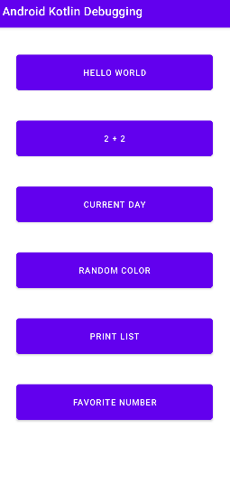

<!-- (This is a comment) INSTRUCTIONS: Go through this page and fill out any **bolded** entries with their correct values.-->

# AND101 Project 2 - Kotlin Debug-a-thon

Submitted by: **Fienna Angeline**

Time spent: **1 hour 30 minutes** hours spent in total

## Summary

**RandomActivities** is an android app that was riddled with some pretty nasty Kotlin bugs.  With those gone, it's a collection of widgets for a variety of purposes! It includes Hello World, a calculator, Current day, random color generator, a list, and favorite number displayer.

If I had to describe this project in three (3) emojis, they would be: 📅🎨📟

## Application Features

<!-- (This is a comment) Please be sure to change the [ ] to [x] for any features you completed.  If a feature is not checked [x], you might miss the points for that item! -->

The following REQUIRED features are completed:

- [x] 👋 Debug and fix navigation to Hello World activity
- [x] 4️⃣ Debug and fix Number Sum (2 + 2) activity
- [x] 📅 Debug and fix Current Day activity 
- [x] 🌈 Debug and fix behavior of Random Color activity
- [x] 🗒️ Debug and fix Print List activity
- [x] 💯 Debug and fix Favorite Number activity

The following STRETCH features are implemented:

- [x] None

The following EXTRA features are implemented:

- [x] None

## Video Demo

Here's a video / GIF that demos all of the app's implemented features:

GIF created with **your chosen GIF tool**

## Notes

You can define an int variable as null as long as you have ? after the int. 

## License

Copyright **2025** **Fienna Angeline**

Licensed under the Apache License, Version 2.0 (the "License");
you may not use this file except in compliance with the License.
You may obtain a copy of the License at

    http://www.apache.org/licenses/LICENSE-2.0

Unless required by applicable law or agreed to in writing, software
distributed under the License is distributed on an "AS IS" BASIS,
WITHOUT WARRANTIES OR CONDITIONS OF ANY KIND, either express or implied.
See the License for the specific language governing permissions and
limitations under the License.
